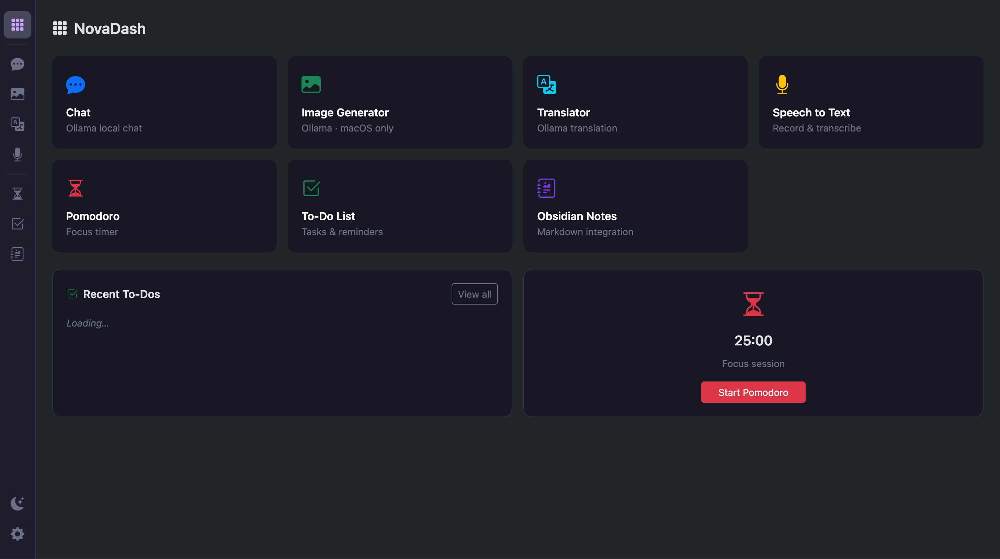
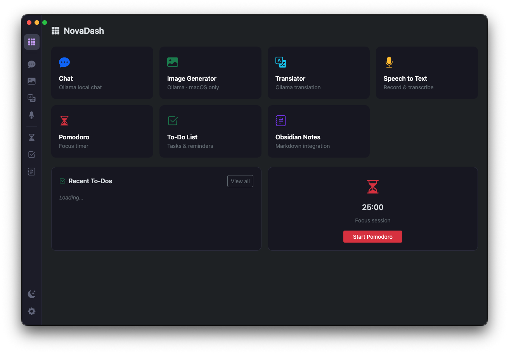
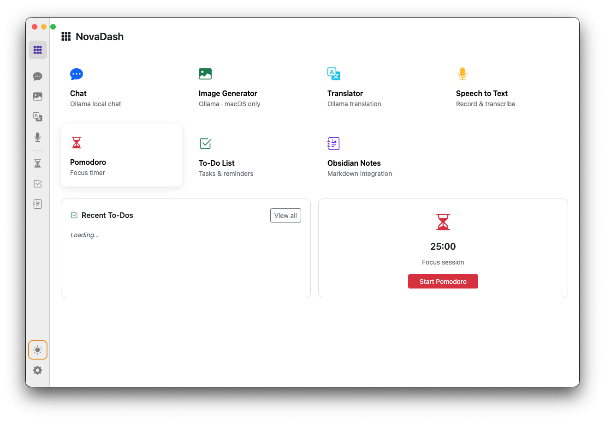

<div align="center">

# NovaDash

**A personal assistant desktop app with a VS Code-style sidebar.**
Brings together Ollama AI tools, productivity utilities, and more — all in one self-contained GUI.



[](https://www.electronjs.org/)
[](https://getbootstrap.com/)
[](https://github.com/WiseLibs/better-sqlite3)
[](LICENSE)

</div>

---

## What is NovaDash?

NovaDash is a **personal productivity hub** built with Electron. Instead of opening a dozen separate apps and browser tabs, everything lives in one unified interface — with a clean icon-only navigation bar inspired by VS Code's activity bar.

You can run it as a **desktop app** (Windows & macOS) or as a **local website** during development with hot reload.

---

## Features

| Module                  | Description                                                            | Platform     |
| ----------------------- | ---------------------------------------------------------------------- | ------------ |
| 🏠 **Dashboard**        | Quick-access overview, recent to-dos, Pomodoro, local time and weather | All          |
| 💬 **Ollama Chat**      | General-purpose chat using any locally installed Ollama model          | All          |
| 🖼️ **Image Generator**  | Generate images via a local Ollama diffusion model                     | macOS only\* |
| 🌐 **Translator**       | Translate text between languages using a local Ollama model            | All          |
| 🎙️ **Speech to Text**   | Record audio and transcribe it to text                                 | All          |
| 💼 **Job Hunting**      | Generate custom CV and motivatiebrief from job postings                | All          |
| ⏱️ **Pomodoro Tracker** | Focus timer with session logging to SQLite                             | All          |
| ✅ **To-Do List**       | Simple persistent task manager backed by SQLite                        | All          |
| 📓 **Obsidian Notes**   | Create and browse Markdown files in your Obsidian vault                | All          |
| 🕒 **Time**             | Live local clock/date/timezone                                         | All          |
| 🌤️ **Local Weather**    | Current local weather and short forecast via geolocation               | All          |

> \* Ollama image generation currently only works on macOS. On Windows, NovaDash shows a graceful "not available" message.

---

## Screenshots

| Dark mode                                   | Light mode                                    |
| ------------------------------------------- | --------------------------------------------- |
|  |  |

---

## Tech stack

- **[Electron](https://www.electronjs.org/)** — cross-platform desktop wrapper (Windows + macOS)
- **[Node.js](https://nodejs.org/)** — runtime
- **[Bootstrap 5](https://getbootstrap.com/)** — UI framework (dark & light mode via `data-bs-theme`)
- **[Bootstrap Icons](https://icons.getbootstrap.com/)** — icon set used throughout the sidebar and pages
- **[better-sqlite3](https://github.com/WiseLibs/better-sqlite3)** — fast synchronous SQLite for local persistence
- **[browser-sync](https://browsersync.io/)** — hot-reload dev server for browser-based iteration
- **Vanilla JS (ES6+)** — no frontend framework, no bundler needed

---

## Getting started

### Prerequisites

- [Node.js](https://nodejs.org/) v18+
- [Ollama](https://ollama.com/) running locally at `http://localhost:11434` (for AI features)

### Install

```bash
git clone https://github.com/matthijskamstra/nova-dash.git
cd nova-dash
npm install
```

> After `npm install`, Bootstrap assets are automatically copied to `src/vendor/` via the `postinstall` script.

---

## Running the app

### Browser dev mode (fastest iteration, with hot reload)

```bash
npm run dev
```

Opens at **http://localhost:3000** — any file change in `src/` reloads the browser instantly.

### Electron desktop app

```bash
npm run dev:electron
```

> **First time on a new machine / after `npm install`:** Native modules need to be compiled against Electron's Node.js version. Run this once:
>
> ```bash
> npm run rebuild
> ```
>
> This only takes a few seconds and does not need to be repeated unless you run `npm install` again.

### Build installer

```bash
npm run build
```

Outputs installable packages to `dist/` (`.dmg` for macOS, `.exe` for Windows).

---

## Project structure

```
nova-dash/
├── main.js                  # Electron main process + IPC handlers
├── preload.js               # Exposes window.novaDash API via contextBridge
├── package.json
├── CLAUDE.md                # Full project context and architecture decisions
├── scripts/
│   └── copy-vendor.js       # Copies Bootstrap assets to src/vendor/
├── src/
│   ├── index.html           # App shell — sidebar + #content area
│   ├── app.js               # Client-side router, theme, platform detection
│   ├── plugins.js           # Dynamic plugin loader/registry
│   ├── styles/
│   │   └── main.css         # Custom styles on top of Bootstrap
│   ├── pages/
│   │   ├── home/
│   │   │   └── page.html    # Dashboard special page
│   │   └── settings/
│   │       └── page.html    # Settings special page
│   ├── plugins/
│   │   ├── chat/
│   │   │   ├── manifest.json
│   │   │   └── plugin.html
│   │   ├── weather/
│   │   │   ├── manifest.json
│   │   │   └── plugin.html
│   │   └── ...
│   ├── vendor/              # Local Bootstrap assets (auto-generated, do not edit)
│   └── db/
│       └── database.js      # SQLite schema and all CRUD functions
└── assets/
    └── icons/               # App icons (.icns, .ico, .png)
```

---

## Architecture notes

- **Self-contained** — no CDN links, no runtime internet fetching. Everything ships in one folder, packaged by `electron-builder`.
- **Manifest-based plugin system** — plugins live in `src/plugins/<id>/` and define metadata in `manifest.json`.
- **Pages are HTML fragments** loaded into `#content` via `fetch()`. No iframes, no full navigation.
- **Routing split** — special pages (`home`, `settings`) load from `src/pages/<id>/page.html`, plugin routes load from `src/plugins/<id>/plugin.html`.
- **SQLite tables:** `todos`, `pomodoro_sessions`, `settings`, `notes`
- **IPC bridge:** all database calls from the renderer go through `window.novaDash.*` which is exposed via `contextBridge` in `preload.js`.
- **Browser mode falls back gracefully** — pages detect whether `window.novaDash` is available and use demo data when running in the browser.
- **Platform detection** — `main.js` exposes `process.platform` via IPC. The `image-gen` page checks this and shows a message on Windows.

---

## Dark / light mode

Click the moon icon at the bottom of the sidebar to toggle. The preference is saved to `localStorage` (browser mode) and SQLite (Electron mode).

---

## Roadmap

- [ ] Functional Ollama Chat page
- [ ] Functional Image Generator (macOS)
- [ ] Functional Translator
- [ ] Speech-to-Text via Web Speech API / Whisper
- [x] Job Hunting Assistant (motivatiebrief + CV generation via Ollama)
- [ ] Pomodoro timer with notifications
- [ ] To-Do list with SQLite persistence
- [ ] Obsidian vault integration (read/write `.md` files)
- [ ] Keyboard shortcuts to switch pages (like VS Code)
- [ ] Tray icon support
- [x] Plugin/module system for new tools (manifest-based)
- [x] Time plugin
- [x] Local weather plugin
- [ ] Windows build & test

---

## Contributing

This is a personal project, but PRs and issues are welcome. Please read [CLAUDE.md](CLAUDE.md) first — it is the source of truth for all architectural decisions.

---

## License

[MIT](LICENSE) — © Matthijs Kamstra
